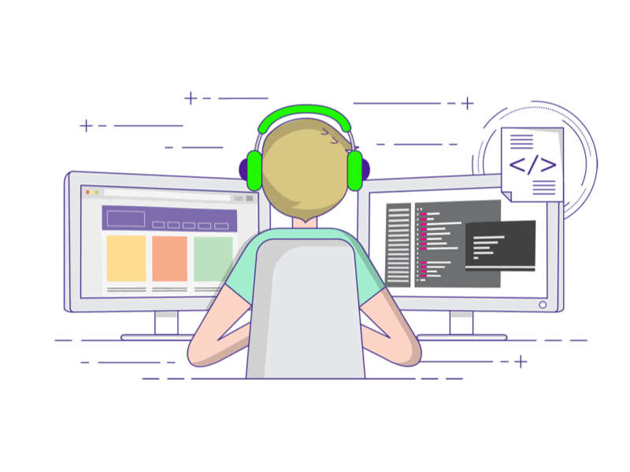

### Hi there, I'm THANH LA 

**Software Engineer · Python Developer · Content Creator**

I build backend systems and developer tools, and I share what I learn on YouTube as [THÀNH IT][website].
My focus is on **Python**, **Golang**, and practical **AI/LLM** engineering — self-hosting models,
local inference with llama.cpp/Ollama, RAG pipelines, and shipping things that actually run in production.

---

### 🚀 About me

- 🔭 Currently building and self-hosting **AI/LLM** tooling and automation.
- 🌱 Deepening my skills in **Golang**, distributed systems, and **LLM engineering**.
- 🎥 Sharing tutorials on Python, Go, Claude Code, and running AI locally on my YouTube channel.
- 💬 Ask me about Python, Golang, Docker/self-hosting, or local LLMs.
- ⚡ Fun fact: I read, run, play piano — and I still love a good anime fight scene 😅

---

### 🧰 Languages and Tools

  
  
  
  
  
  
  
  
  
  
  
  

---

### :zap: GitHub Stats

<table>
<tr>
  <td width="48%">
    
    
  </td>
  <td width="52%"></td>
</tr>
</table>

---

### 📺 YouTube Videos

<!-- YOUTUBE:START -->
- [TỰ HOST AI LOCAL #2: TÍCH HỢP THÊM NHIỀU TÍNH NĂNG MỚI](https://www.youtube.com/watch?v=a5kXRpZZhZ8)
- [TỰ HOST AI LOCAL #1: CHẠY MODEL QWEN VỚI LLAMA.CPP](https://www.youtube.com/watch?v=eYtsRyF2I_U)
- [Tâm sự IT: Tại sao mình nghỉ việc ở tuổi 30?](https://www.youtube.com/watch?v=TkcO0tRrbTk)
- [Hướng dẫn cài đặt bộ Skill cực hay cho Claude Code](https://www.youtube.com/watch?v=Fv2zptkz7uc)
- [Go with Claude Code #2: Hiểu sâu về Channel trong Golang](https://www.youtube.com/watch?v=Lgd5I-445J8)
<!-- YOUTUBE:END -->

---

### 📫 Contact me

- 📧 Email: lathanhmta@gmail.com
- 📺 YouTube: [THÀNH IT][website]

[website]: https://www.youtube.com/channel/UC9L5_YMFz8JfBeQtUic8-3A
